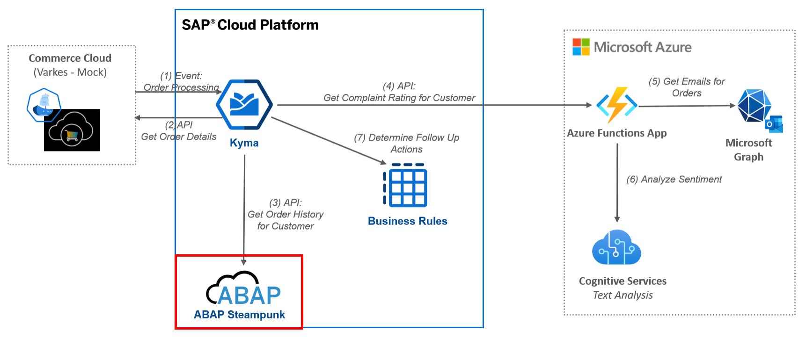

# ABAP Steampunk Service for Orderhistory

This repository contains the source code for the SAP Commerce Cloud mock including all files relevant for building the docker image and deploying the application to Kyma.

For details and the end2end context please visit the blog post [Building a Side-by-side Extension with Kyma and Microsoft Azure](https://blogs.sap.com/2021/01/12/building-a-side-by-side-extension-with-kyma-and-microsoft-azure/)
